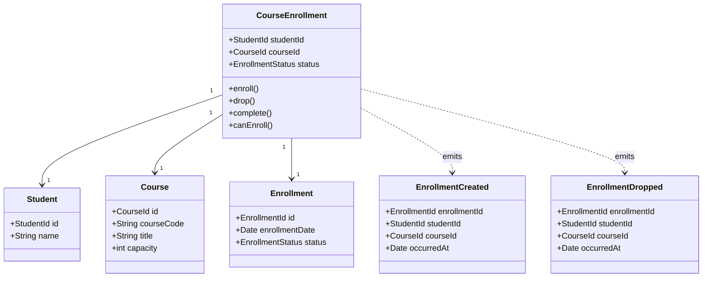

This is **LAB 03 — University Enrollment DDD**.

### Task

> **Model the `CourseEnrollment` aggregate root, enforce invariant limits, and emit domain events.**

I can prepare this for you in the same **GitHub-ready format** as Lab 02, including:

1. **DDD domain model**
2. `CourseEnrollment` aggregate root
3. Entities/value objects
4. Business invariants
5. Domain events
6. **Mermaid class diagram**
7. GitHub-ready code/documentation

For example, the core model would look like:

### Example Invariants

The `CourseEnrollment` aggregate should enforce rules such as:

* A student **cannot enroll in the same course twice**.
* A student **cannot enroll if the course is full**.
* A student **cannot drop a course after it has been completed**.
* Only a valid enrollment can be marked as completed.
* Every important state change should generate the appropriate **domain event**.

If you want, I can now give you the **complete Lab 03 GitHub code**, including the **Mermaid DDD diagram + Java code + invariants + domain events**.

